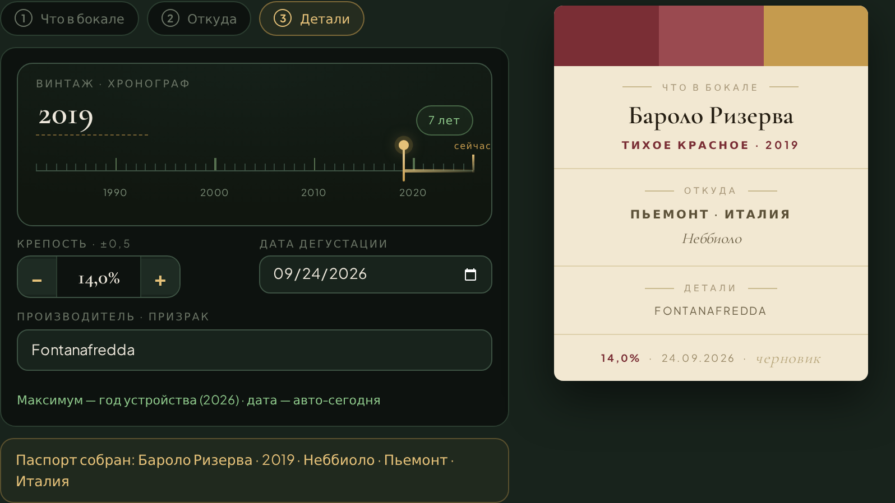
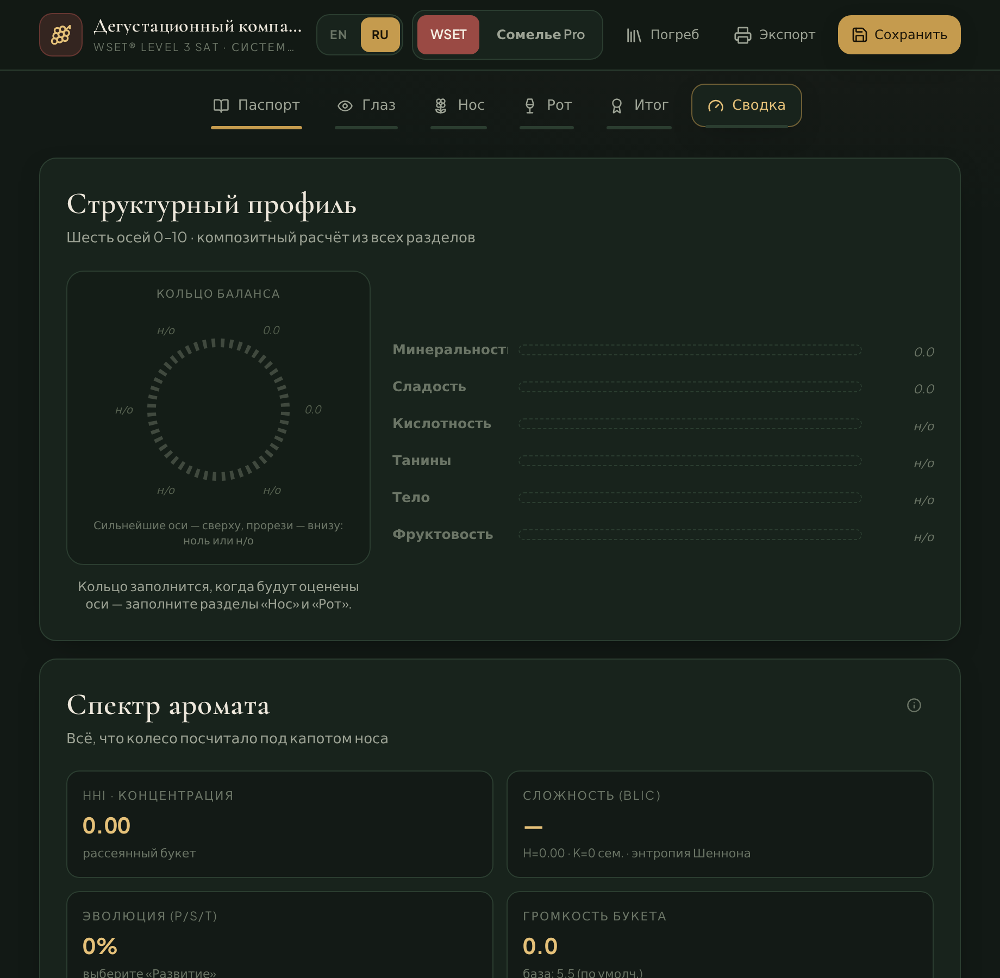
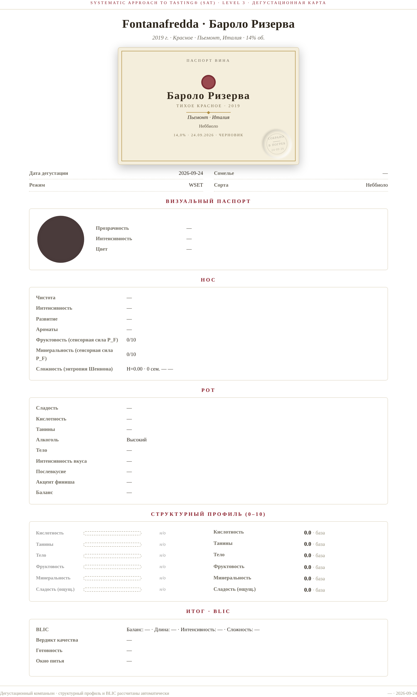
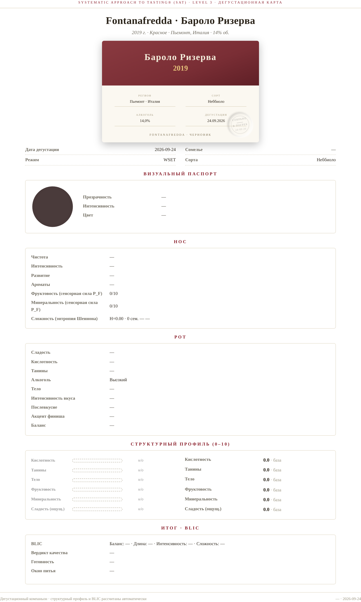
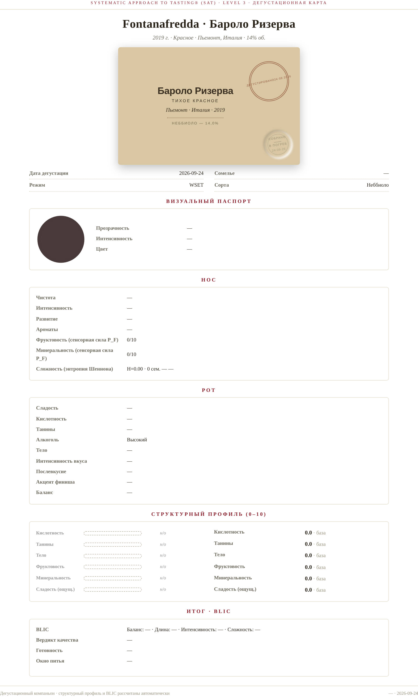
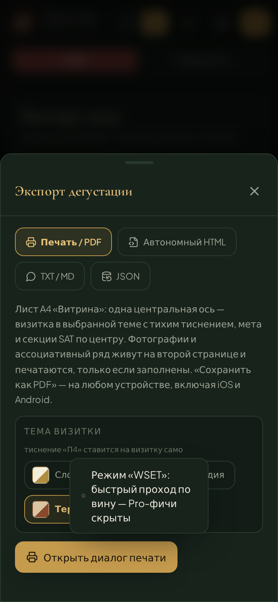

# 🍷 Sommelier SAT Companion

**A tasting notebook that thinks in WSET.** Describe every bottle you drink in the language of the WSET® Level 3 Systematic Approach to Tasting — with a structural profile engine, an anomaly detector and a print shop that lays out your notes like a wine passport.

[](LICENSE)
[](https://react.dev)
[](tsconfig.json)
[](#-pwa)

**Demo (GitHub Pages):** `https://<your-nickname>.github.io/sommelier-sat-companion/` ·
**Single-file build:** [`docs/index.html`](docs/index.html) — download it, open it on a phone, it just works. No server, no account, no telemetry: your cellar lives in IndexedDB on your device.

---

## The story

I built this for myself. Not for an exam, not for a blog — my tasting notes were a mess: half-sentences in phone memos, three different notebooks, photos of labels lost somewhere in the gallery. I wanted one place where every bottle gets described *properly* — structured, honest, comparable months later.

The grammar I borrowed from the WSET Level 3 SAT, because it's the most honest one I know: no points, no "I liked it" — just what's actually in the glass. On top of it lives **Sommelier Lab Pro** — the free-play mode with a HEX color disc, acidity waveforms, a tannin texture matrix, a caudaliemeter (yes, a stopwatch for the finish) and a 100-point scale, if you miss points.

The workflow is deliberately tiny: **three taps** — *what's in the glass → where it's from → details* — and the wine has a passport. Eyes, nose, palate and the verdict (BLIC) come after, at your own pace.

## What's inside

- 🎓 **Two modes.** **WSET** — strict, exam-shaped: one color category, ABV caliber, BLIC without scores, and a «submission sheet» that honestly tells you how much of the SAT you actually filled. **Sommelier Lab Pro** — everything above plus the toys. Switching to WSET strips the Pro fields: SAT doesn't recognize them.
- 🧮 **A structural profile engine.** Six axes (0–10) computed from your answers — with full contribution tails, so every score can be explained down to "this came from the lime notes".
- 🕵️ **An anomaly detector.** Nine rules that catch logical contradictions — "high acidity but round texture?", "sweet with no fruit anchor?" — before you submit nonsense to yourself.
- 🖨 **A print shop, «Vitrina».** An A4 sheet laid out on one vertical axis with a wine card in three themes (Ivory / Burgundy / Terroir) and a blind **emboss stamp**. Optional stuff — photos, associations — goes to page 2, and page 2 only exists if there's something to show.
- 📦 **Exports that agree with each other.** Print/PDF, standalone HTML, TXT, Markdown, JSON backup — all built from one deterministic digest, so the print never disagrees with the TXT.
- 📷 **A cellar.** IndexedDB storage, compressed photos, full JSON backup/restore. Offline from day one, fonts included.

## Screenshots

| Passport (WSET) | Submission sheet |
|---|---|
|  |  |

| Print «Vitrina»: Ivory | Burgundy | Terroir |
|---|---|---|
|  |  |  |

*Mobile 390px:* 

## How it thinks

No magic — arithmetic you can argue with. Every axis of the profile is a small formula over your answers, with masking and reinforcement terms. The fun part: **minerality is never asked directly.** It's *computed* — flint, slate, TDN, iodine and salt found in the aroma wheel and free text (regex markers) flow into the axis. A Barolo with "graphite" notes arrives at minerality 7+ on its own.

<details>
<summary><b>📊 The full math — for those who want the numbers</b></summary>

Six axes, each 0–10, each a composite of adjacent SAT parameters:

- **Acidity** = base (scale answer) − sugar masking (−0.5…−2.0) + wave shape bonus/penalty (6 acidity profiles).
- **Tannins** = base + 0.5·(acidity ≥ med+) − sugar smoothing + texture contribution (−1.2…+1.2 across 6 textures).
- **Body** = base + sugar (0…+2) + alcohol (−0.5…+1.5) + legs/glycerin + new oak.
- **Fruitiness** = slider − development decay + 0.5·(finish ≥ 8 s).
- **Minerality** — fully computed: regex markers (flint / slate / TDN / iodine / salt) harvested from the aroma wheel, finish and free text.
- **Perceived sweetness** = sugar − acidity drying (up to −1.6) − tannin drying (up to −1.2).

Balance (the B in BLIC) follows two house rules: *sweet with a bright fruit anchor is not penalized*; *sweet without an anchor is a imbalance* (fruit slider < 4 at off-dry and above). The engine (`structuralProfile.ts`) keeps the full contribution tail for every axis, so the UI can show *why* the number is the number.

</details>

## The card & the print shop

The sheet is built on one vertical axis: brand line → title → **wine card** → metadata → SAT sections → verdict pills. The wine card comes in three themes:

- **Ivory** — paper frame with a gold keyline, wine-color disc, diamond rule;
- **Burgundy** — bordeaux ribbon header, gold vintage, 2×2 facts grid, producer footer;
- **Terroir** — kraft paper, bold sans, ink stamp *«dégusté»*, dotted leaders.

The card carries an **emboss stamp (П4)**: a blind impression *«assembled · to cellar · date»* — no ink, just light and shadow. The standalone HTML export is assembled in the same system, so what you print is what you share.

## Try it

**Zero-install:** grab [`docs/index.html`](docs/index.html), send it to your phone, open it. It's a full offline app in one file.

**As a PWA:** serve the `dist/` build over HTTPS, install from the browser, get the Gothic passport-check icon on your home screen.

**From source:**

```bash
npm install
npm run dev          # dev server on :5173
npm run build        # typecheck + PWA build → dist/
npm run build:single # one self-contained HTML → dist-single/index.html
npm run icons        # regenerate PWA icons (dependency-free PNG rasterizer)
```

**GitHub Pages:** Settings → Pages → *Deploy from a branch* → `main` → `/docs`. Update: `npm run build:single && cp dist-single/index.html docs/index.html`.

## Roadmap

- ⭕ **Balance ring** — a one-look ring gauge for the six-axis profile (in the works)
- 🔍 Cellar search & filters
- 🎴 More wine-card themes for the print shop
- 🌐 UI language parity polish (RU/EN already ship)

## 🇷🇺 Русская версия

<details>
<summary><b>Открыть README по-русски</b></summary>

**Сомелье SAT Компаньон** — блокнот дегустаций, который думает по WSET. Я сделал его для себя: заметки по винам жили в трёх блокнотах, мемах телефона и фотках этикеток, и ни одну дегустацию нельзя было честно сравнить с другой. Скелет — WSET Level 3 SAT, самая честная грамматика вкуса: без очков и «мне понравилось», только то, что в бокале. Сверху — режим **Sommelier Lab Pro**: диск цвета в HEX, формы кислотности, матрица танинов, каудалиемер и 100-балльная шкала.

**Три касания** — «что в бокале → откуда → детали» — и у вина есть паспорт. Дальше Глаз, Нос, Рот и вердикт BLIC в своём темпе. Всё хранится локально (IndexedDB), один HTML-файл работает офлайн.

**Два режима.** **WSET** — быстрый проход по вину: одна категория цвета, калибр ABV, строго BLIC, «Бланк к сдаче» честно показывает заполненность SAT. **Pro** — всё остальное. Переключение в WSET обнуляет Pro-поля (SAT их не признаёт).

**Математика профиля.** Шесть осей 0–10, каждая — формула над ответами SAT:

- **Кислотность** = база − маскировка сахаром (−0.5…−2.0) + форма волны (6 профилей).
- **Танины** = база + 0.5·(кислота ≥ med+) − сглаживание сахаром + текстура (−1.2…+1.2).
- **Тело** = база + сахар (0…+2) + алкоголь (−0.5…+1.5) + ножки + новый дуб.
- **Фруктовость** = ползунок − увядание + 0.5·(финиш ≥ 8 с).
- **Минеральность** — не спрашивается, а вычисляется: regex-маркеры (кремень/сланец/TDN/йод/соль) из колеса ароматов, финиша и свободного текста.
- **Ощущаемая сладость** = сахар − кислота сушит (до −1.6) − танины сушат (до −1.2).

Баланс (B из BLIC): «сладкое с ярким фруктовым якорем не штрафуется», «сахар без якоря» — дисбаланс (фрукты < 4 при полусладком+). У каждой оси — полный хвост вкладов, поэтому интерфейс всегда может показать, *почему* число — число.

**Печать «Витрина».** Лист на одной вертикальной оси: бренд → титул → визитка вина (Слоновая кость / Бургундия / Терруар) → мета → секции SAT → итог. На визитке — тиснение П4: слепой оттиск «собрано · в погреб · дата» без краски. Всё опциональное (фото, ассоциативный ряд) уходит на вторую страницу, и она появляется только если есть что показывать. Автономный HTML-экспорт собирается в той же системе.

**Сборка:**

```bash
npm install
npm run dev          # dev-сервер :5173
npm run build        # typecheck + PWA → dist/
npm run build:single # один HTML → dist-single/index.html
npm run icons        # перегенерация иконок (свой PNG-растеризатор)
```

**GitHub Pages:** Settings → Pages → ветка `main` → папка `/docs`.

</details>

## Disclaimer

WSET® and Systematic Approach to Tasting® are registered trademarks of the Wine & Spirit Education Trust. This project is an independent personal tool, not affiliated with and not endorsed by WSET Ltd. SAT structure is described to the extent available in open educational materials. Drink responsibly — 18+/21+ depending on your jurisdiction.

## License

[MIT](LICENSE) — use it, fork it, taste with it. 🍷
